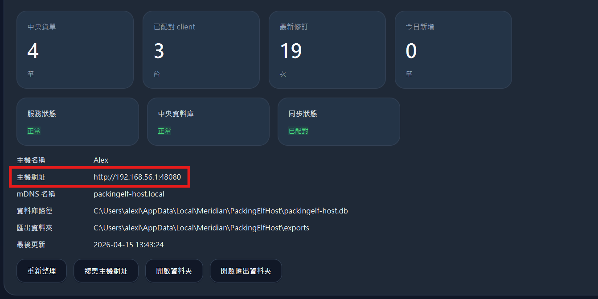
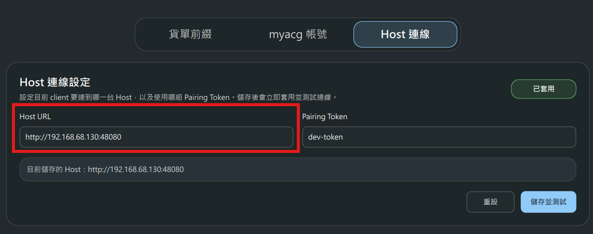

# PackingElf

- [安裝說明](docs/INSTALLATION.md)
- [測試說明](docs/TESTING.md)

## Client 如何連到 Host

當 `Host` 安裝在另一台電腦時，請先在 `Host` 電腦打開 **包貨小精靈 Host**，然後查看畫面上的 **主機網址**。



接著在 `Client` 電腦打開 **設定**，切到 **Host 連線** 分頁，把剛剛看到的網址填進 `Host URL`，再輸入 `Host` 顯示的 `Pairing Token`，最後按 **儲存並測試**。



建議：

- 優先使用 `http://192.168.x.x:48080` 這種區網 IP
- 不要先用 `127.0.0.1`，那只代表目前這台電腦自己
- 如果測試失敗，請先確認 `Host` 電腦的 Windows Firewall 已放行 TCP `48080`

## 常用開發指令

### 列出 CMake presets

```powershell
cd desktop-app
cmake --list-presets
```

### Debug build

```powershell
cd desktop-app
cmake --preset msvc-debug
cmake --build --preset msvc-debug
```

### Release build

```powershell
cd desktop-app
cmake --preset msvc-release
cmake --build --preset msvc-release
```

### 執行桌面 app

```powershell
# Debug
.\desktop-app\build\msvc-debug\Debug\packingelf.exe

# Release
.\desktop-app\build\msvc-release\Release\packingelf.exe
```

## 打包安裝程式

```powershell
# 只產生 portable client / host
.\scripts\build-installer.ps1 -PortableOnly

# 產生正式 Windows installer
.\scripts\build-installer.ps1

# 如果要強制使用 Qt Installer Framework
.\scripts\build-installer.ps1 -PreferIfw
```

安裝程式輸出：

```text
dist/PackingElf-Setup-1.0.3.exe
```

## 建議發佈方式

- 把 installer `.exe` 上傳到 GitHub Releases
- 給使用者 GitHub Releases 的下載連結
- 使用者只需要下載並執行 installer，不需要 Git 或任何開發工具
