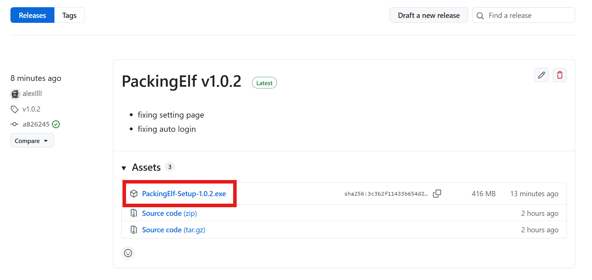
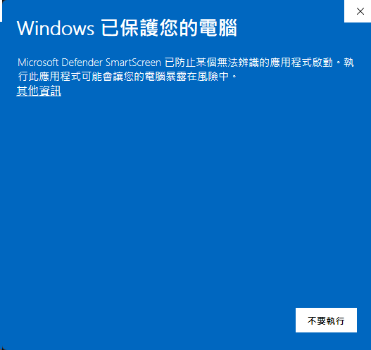
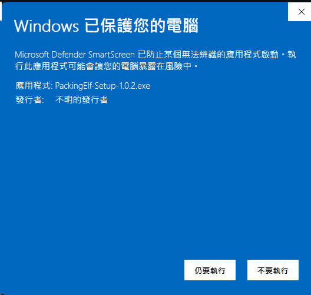
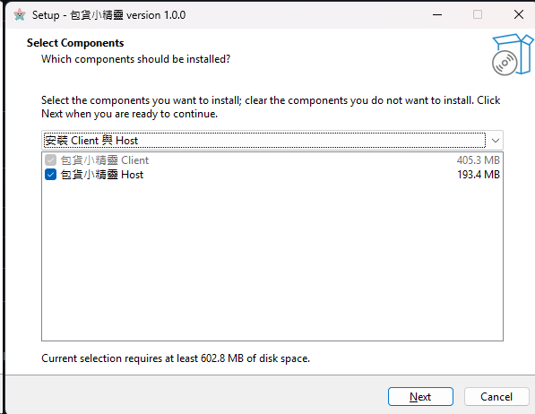

# PackingElf 安裝說明

這份文件是給一般使用者的安裝指引。  
如果你只需要使用程式，照著做就可以，不用安裝任何開發工具。

## 下載安裝檔

1. 到 GitHub 的 `Releases` 頁面。
2. 下載最新版本的 `PackingElf-Setup-*.exe`。

## 執行安裝檔

下載完成後，直接點安裝檔。

第一次執行時，Windows 可能會先顯示保護提示：

如果有看到這個畫面：

1. 點 `其他資訊`
2. 再點 `仍要執行`

## 選擇要安裝的元件

安裝程式可以安裝兩個App：

- `包貨小精靈 Client`
- `包貨小精靈 Host`

請依照電腦用途選擇：

- 一般作業電腦：安裝 `Client`
- 放中央資料庫的主機電腦：安裝 `Host`
- 如果同一台電腦要同時使用兩種：兩個都勾選

## 安裝完成後

安裝完成後，Windows 開始功能表會出現對應捷徑。

第一次開啟時，程式會自動建立：

- 本機設定檔
- 本機資料庫
- 記錄檔資料夾

不需要手動建立任何資料夾。

## Host 與 Client 的建議

### Host 電腦

- 安裝 `包貨小精靈 Host`
- 保持主機電腦開機
- 確認 office Wi-Fi 可讓其他 client 連到這台主機資料庫

### Client 電腦

- 安裝 `包貨小精靈 Client`
- 在設定頁設定 `myacg` 帳號
- 將主機網址指向 Host 電腦

## 升級版本

如果要更新到新版本：

1. 先關閉程式
2. 直接重新執行新的 installer
3. 使用和上次相同的安裝選項

一般情況下不需要先手動解除安裝。

## 常見問題

### 1. 安裝時看到 Windows 保護畫面

這通常是因為程式還沒有正式簽章。  
請點 `其他資訊` 後再按 `仍要執行`。

### 2. 安裝後找不到資料

使用者資料會放在 Windows AppData 目錄，不在安裝目錄內。

### 3. Client 啟動了，但無法連到 Host

請先確認：

- Host 程式有開著
- Host 電腦和 Client 電腦在同一個網路
- Client 設定的是正確的主機網址與配對碼
